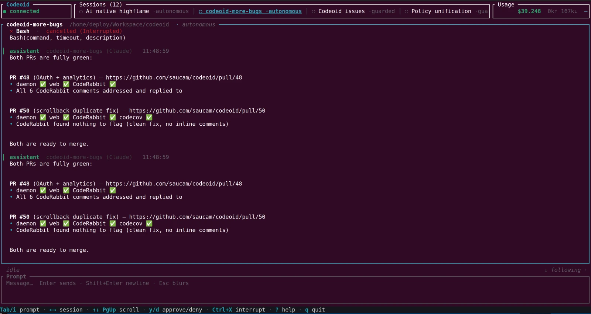
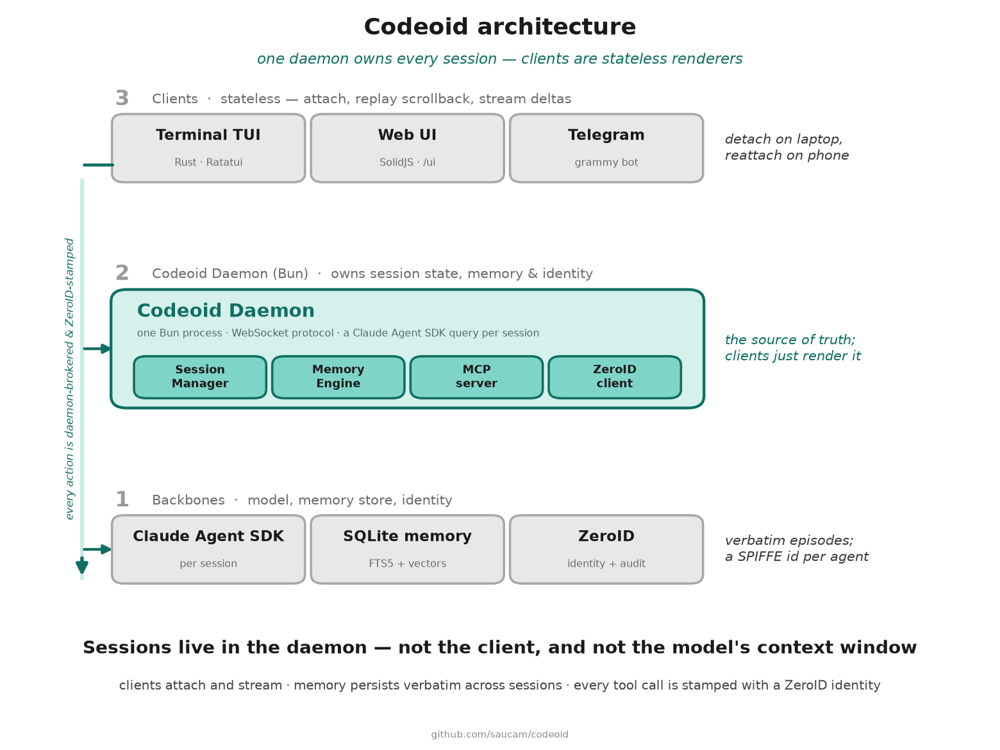
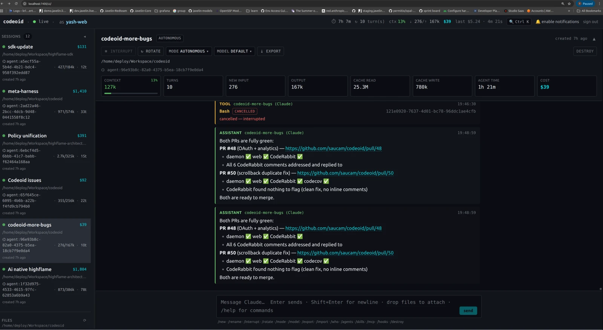
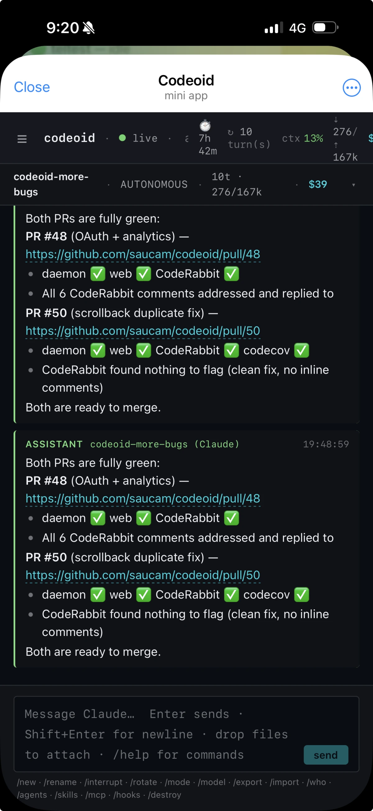

# Codeoid

[](https://www.npmjs.com/package/codeoid)
[](https://www.npmjs.com/package/codeoid)
[](https://github.com/saucam/codeoid/actions/workflows/ci.yml)
[](https://codecov.io/gh/saucam/codeoid)
[](https://www.npmjs.com/package/codeoid)
[](LICENSE)
[](https://bun.sh)

**Identity-first control plane for AI coding agents — multi-session, multi-frontend, with cross-session memory.**

Run N parallel Claude Code sessions across repos. Switch between them from a terminal cockpit, a web UI, or Telegram. Every action auditable; every agent (and sub-agent) has a cryptographic identity via [ZeroID](https://github.com/highflame-ai/zeroid). Memory persists across sessions so Claude inherits what it learned last time.

> **Terminal client lives in its own repo.** The recommended cockpit is [**codeoid-tui**](https://github.com/saucam/codeoid-ui) — a native Rust/[Ratatui](https://ratatui.rs) client that speaks the daemon's WebSocket protocol. A built-in `codeoid tui` (Ink/React) ships in this repo as a zero-install fallback. See [Terminal client](docs/FEATURES.md#terminal-client).

<p align="center">
  
</p>
<p align="center">
  <sub><b>codeoid-tui</b>, the native Rust cockpit, tracking 12 parallel sessions at once. The same sessions open in a <a href="#interfaces">browser and on Telegram</a> — one daemon, one source of truth.</sub>
</p>

## Contents

- [Why Codeoid](#why-codeoid)
- [How Codeoid compares](#how-codeoid-compares)
- [Quick start](#quick-start)
- [Architecture](#architecture)
- [Features](#features)
- [Configuration](#configuration)
- [CLI reference](#cli-reference)
- [Development](#development)
- [Contributing & security](#contributing--security)

## Why Codeoid

You're orchestrating AI coding agents. Codeoid solves the things Claude Code's single-terminal experience can't:

- **Parallel sessions, shared workspace memory** — Two sessions on two git worktrees building feature A and feature B. Both inherit the same workspace's history. Session B can `recall()` what Session A learned yesterday, no re-read.
- **Never-lose-detail memory** — Every tool call, result, and reasoning block persists as a retrievable episode. No lossy compaction. Recall returns the real bytes.
- **Three-layer context reduction** — Pre-entry compression of CLI output + auto-rotation of the backing context + verbatim recall. Turns that would have cost $0.30 drop to pennies; peak occupancy stays below compaction.
- **Mid-turn streaming input (VSCode parity)** — Send a follow-up message while Claude is already responding. Priority semantics (`now` / `next` / `later`) let you interrupt-and-re-integrate or gracefully queue for the next turn.
- **Production-grade token instrumentation** — Per-turn input/output/cache/cost persisted to SQLite. Live StatusBar shows cumulative + Δ this-turn + cache hit rate + current context occupancy + queue depth + rotation count.
- **Autonomous runs with a budget** — Flip a session to autonomous mode; it auto-approves safe operations until a write/exec budget is spent, then hands control back.
- **Device handoff** — Start a session on your laptop, attach from your phone. Scrollback replays. Same conversation.
- **Identity-grade audit** — Every tool call stamped with the SPIFFE URI of the agent that made it. Sub-agents get their own attenuated identities. Delegation chain traceable top to bottom.
- **Multi-frontend** — same session accessible from terminal TUI, browser, or Telegram bot. Share read-only tokens with a teammate.

## How Codeoid compares

Codeoid isn't a general-purpose IDE assistant. It's built for **long-horizon, multi-session agent work**, where context continuity and token economics matter more than inline code actions — so it optimizes for what the tools you already use don't: verbatim cross-session memory, parallel sessions on one control plane, a cryptographic identity per agent and sub-agent, and per-turn token economics.

Its closest peer is **[Omnigent](https://github.com/omnigent-ai/omnigent)**, a *meta-harness* that puts many different agents (Claude Code, Codex, Cursor, Pi) behind one governance layer with an OS-level sandbox and cross-harness model routing. Codeoid trades that breadth for depth on a single harness — workspace-scoped verbatim memory, per-agent identity, and per-turn token economics. Rule of thumb: reach for Omnigent to orchestrate *many different* agents with OS isolation; reach for Codeoid if you live in Claude Code across weeks and devices and want memory that returns the exact bytes it saw last time.

📊 **[Full capability matrix →](docs/COMPARISON.md)** — feature by feature against Claude Code CLI, the VSCode extension, Cursor, Aider, and Omnigent.

## Quick start

### Prerequisites

- [Bun](https://bun.sh) v1.0+
- Claude Code CLI logged in (`claude login`) or `ANTHROPIC_API_KEY` set
- A ZeroID identity — either the hosted Highflame SaaS (no infra) or a [self-hosted ZeroID](https://github.com/highflame-ai/zeroid)

### Install

**From npm (recommended)** — Codeoid runs on Bun, so install it with Bun (`npm` also works as long as Bun is on your `PATH`, since it's the runtime):

```bash
bun install -g codeoid        # or: npm install -g codeoid
```

This puts a `codeoid` command on your `PATH`. Everywhere below you can run `codeoid <cmd>` directly — e.g. `codeoid login`, `codeoid start`, `codeoid tui`.

**From source** — to hack on it:

```bash
git clone https://github.com/saucam/codeoid.git
cd codeoid
bun install
```

From a source checkout, run `bun src/cli.ts <cmd>` in place of `codeoid <cmd>` below.

### Authenticate

Codeoid needs one thing to start: a ZeroID key. Two ways to get one.

**Option A — Highflame SaaS (recommended, no infra)**

1. Sign up at [highflame.ai](https://highflame.ai) and open Studio → **Code Agents**.
2. Create a key (you'll get a `zid_sk_...`).
3. Log in — Codeoid ships pointing at the Highflame SaaS issuer, so there's nothing else to configure:

   ```bash
   bun src/cli.ts login          # prompts for the key (hidden), verifies it, saves to ~/.codeoid/config.json
   ```

**Option B — Self-hosted ZeroID**

Run your own [ZeroID](https://github.com/highflame-ai/zeroid), register an agent to get a key, then point Codeoid at it. `--zeroid` accepts a preset (`highflame`, `highflame-dev`, `local`) or any URL:

```bash
bun src/cli.ts login --zeroid local                       # local ZeroID on :8899
bun src/cli.ts login --zeroid https://zeroid.mycorp.com   # your deployment
```

The issuer is pinned to whatever you log in against — a token minted by any other issuer is rejected. `login` exchanges the key on the spot and prints the subject + granted scopes so you know it works before the daemon ever starts.

### Run

```bash
# Start the daemon — serves TUI/web/Telegram + mounts memory
bun src/cli.ts start
```

Then connect a client:

```bash
# Recommended: the native Rust cockpit (separate repo).
#   git clone https://github.com/saucam/codeoid-ui && cd codeoid-ui
#   cargo run -p codeoid-tui --release
#
# Or the built-in fallback TUI (Ink/React, no extra install):
bun src/cli.ts tui
```

Or browse to http://localhost:7400/ui/ for the web UI.

## Architecture

<p align="center">
  
</p>

In one Bun process the daemon brokers everything between your clients and Claude, and owns three subsystems:

- **Session Manager** — per-session mode + write/exec budget, pinned files, the sub-agent tree, scrollback, and a JSONL transcript for crash-safe resume.
- **Memory Engine** — a chunker turns every tool call into a verbatim *episode*; a hybrid ranker (vectors + FTS5 BM25 + recency + path overlap) serves it back. Backed by SQLite (FTS5 + embeddings + file-read cache) and exposed to Claude as an **in-process MCP server** — `recall()`, `recall_file()`, `timeline()`.
- **ZeroID client** — registers the session's SPIFFE identity and mints attenuated tokens for each sub-agent.

Each session drives its own **Claude Agent SDK** query. The diagram above shows how the pieces fit.

Sessions are daemon-owned. Clients are stateless; they attach, receive scrollback replay, and stream live deltas. Detach and re-attach from anywhere.

## Features

Codeoid goes deep on a single harness. Full detail — keybindings, slash commands, ranking weights, rotation thresholds — lives in **[docs/FEATURES.md](docs/FEATURES.md)**. The highlights:

**Memory & context**

- **[Cross-session memory](docs/FEATURES.md#cross-session-memory)** — every tool call, result, and reasoning block is stored verbatim as a retrievable *episode*, served back by a hybrid ranker (vectors + FTS5 + recency + path overlap). Claude gets `recall()`, `recall_file()`, and `timeline()`.
- **[Workspace memory index](docs/FEATURES.md#context-reduction-stack)** — a compact hot-files + topic-clusters + recent-sessions block auto-injected into every system prompt, so a fresh session starts already oriented.
- **[Three-layer context reduction](docs/FEATURES.md#context-reduction-stack)** — pre-entry CLI-output compression, backing-context auto-rotation, and verbatim recall. All lossless: recall returns the original bytes.

**Sessions & control**

- **[Parallel sessions + git worktrees](docs/FEATURES.md#parallel-sessions--git-worktrees)** — run features side by side; branches share one workspace memory, anchored on `git-common-dir`.
- **[Execution modes](docs/FEATURES.md#execution-modes)** — `guarded` / `interactive` / `autonomous`, the last with a write-action budget that reverts to guarded when spent.
- **[Mid-turn streaming input](docs/FEATURES.md#mid-turn-streaming-input-vscode-parity)** — send a follow-up while Claude is still responding; `now` / `next` / `later` priority.
- **[Attachments](docs/FEATURES.md#attachments)** — `@file` mentions, one-shot `/context`, and persistent `/pin`; drag-drop in the web UI.

**Identity & resilience**

- **[Cryptographic identity per agent + sub-agent](docs/FEATURES.md#identity-chain)** — ZeroID SPIFFE/WIMSE URIs stamped on every tool call; `/who` prints the full delegation chain, and revoking the parent kills it.
- **[Production resilience](docs/FEATURES.md#production-resilience)** — retry-with-fallback, graceful shutdown, transcript-based resume, rate limiting, keep-warm interrupt, and never-lose-message persistence.

### Interfaces

One daemon, one source of truth, three ways in: the [terminal cockpit](docs/FEATURES.md#terminal-client) (shown at the top), a browser, and Telegram. [Device handoff](docs/FEATURES.md#device-handoff) lets you start on one and pick the session up on another — scrollback replays.

<p align="center">
  
</p>
<p align="center">
  <sub>The SolidJS web UI at <code>localhost:7400/ui</code> — session list on the left, live log in the center, a metrics strip on top (turns, tokens, cache reads, cumulative cost).</sub>
</p>

<p align="center">
  
</p>
<p align="center">
  <sub>The same session on a phone, in the Telegram mini app — identical scrollback, a live header, served by the bot over the same WebSocket.</sub>
</p>

Full keybindings, slash commands, and the Telegram command set → **[docs/FEATURES.md](docs/FEATURES.md#terminal-client)**.

## Configuration

Codeoid reads `~/.codeoid/config.json` and environment variables; env-only secrets (like the Telegram bot token) live in `~/.codeoid/.env` so they survive daemon restarts. Every client action is gated by a ZeroID permission scope, and scopes attenuate into revocable read-only share tokens for teammates.

→ **[Configuration & permission scopes](docs/CONFIGURATION.md)** — every environment variable, the `config.json` schema, the `~/.codeoid/.env` file, and the full scope list.

## CLI reference

```bash
bun src/cli.ts start [--port 7400] [--host 127.0.0.1] [--no-telegram] [--no-web]

bun src/cli.ts tui                                   # Launch the cockpit TUI
bun src/cli.ts ls                                    # List sessions
bun src/cli.ts new <name> [workdir]                  # Create session
  --worktree <branch>                                #   auto-spawn a git worktree
  --repo <path>                                      #   worktree source (default: cwd)
  --worktree-dir <path>                              #   override target dir
bun src/cli.ts attach <session>                      # Readline streaming attach
bun src/cli.ts send <session> <message...>           # One-shot send
bun src/cli.ts interrupt <session>                   # Interrupt
bun src/cli.ts approve <session> [--deny]            # Approve / deny pending tool
bun src/cli.ts destroy <session>                     # Destroy
```

## Development

```bash
bun install              # install deps
bun run dev              # run daemon with --watch
bun run build            # build to dist/
bun run typecheck        # type check
bun run lint             # lint with biome
bun test                 # run unit tests (memory, attachments, etc.)
```

### Key files

| Area | File |
|---|---|
| CLI + command routing | [src/cli.ts](src/cli.ts) |
| Daemon HTTP + WebSocket | [src/daemon/server.ts](src/daemon/server.ts) |
| Session orchestration | [src/daemon/session-manager.ts](src/daemon/session-manager.ts), [src/daemon/session.ts](src/daemon/session.ts) |
| Memory engine | [src/daemon/memory/](src/daemon/memory/) |
| Attachments + limits | [src/daemon/attachments.ts](src/daemon/attachments.ts) |
| Git worktree helper | [src/worktree.ts](src/worktree.ts) |
| Web UI server (serves `web/dist` at `/ui`) | [src/frontends/web-ui/index.ts](src/frontends/web-ui/index.ts) |
| Web UI app (SolidJS) | [web/](web/) |
| Telegram bot | [src/frontends/telegram/index.ts](src/frontends/telegram/index.ts) |
| Built-in TUI (Ink, legacy fallback) | [src/tui/](src/tui/) |
| Native TUI (Rust, recommended) | [saucam/codeoid-ui](https://github.com/saucam/codeoid-ui) |
| Protocol types | [src/protocol/types.ts](src/protocol/types.ts) |

## Contributing & security

PRs welcome — see [CONTRIBUTING.md](CONTRIBUTING.md). For vulnerabilities, see
[SECURITY.md](SECURITY.md) (please don't open public issues for security).

## License

[MIT](LICENSE) © Codeoid

---

Powered by [ZeroID](https://github.com/highflame-ai/zeroid) + [Claude Agent SDK](https://github.com/anthropics/claude-agent-sdk-typescript). Terminal cockpit: [codeoid-tui](https://github.com/saucam/codeoid-ui).
